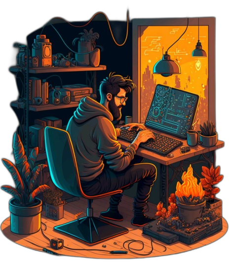

## Rodrigo Santos.
 

Desenvolvedor Front End & UI UX Designer

Meu objetivo é continuar crescendo em minha carreira e colaborar em projetos inovadores que impactem positivamente a vida das pessoas.

Como profissional, valorizo a colaboração em equipe, a solução criativa de problemas e a busca constante por conhecimento e crescimento. Estou sempre procurando novas oportunidades de carreira que possam me desafiar e me permitir desenvolver minhas habilidades.

  

 
  
   

